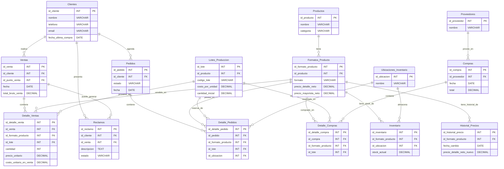

```mermaid
erDiagram
    Clientes {
        id_cliente INT PK
        nombre VARCHAR
        telefono VARCHAR
        email VARCHAR
        fecha_ultima_compra DATE
    }
    Ventas {
        id_venta INT PK
        id_cliente INT FK
        id_punto_venta INT FK
        fecha DATE
        total_bruto_venta DECIMAL
    }
    Detalle_Ventas {
        id_detalle_venta INT PK
        id_venta INT FK
        id_formato_producto INT FK
        id_lote INT FK
        cantidad INT
        precio_unitario DECIMAL
        costo_unitario_en_venta DECIMAL
    }
    Productos {
        id_producto INT PK
        nombre VARCHAR
        categoria VARCHAR
    }
    Formatos_Producto {
        id_formato_producto INT PK
        id_producto INT FK
        formato VARCHAR
        precio_detalle_neto DECIMAL
        precio_mayorista_neto DECIMAL
    }
    Lotes_Produccion {
        id_lote INT PK
        id_producto INT FK
        codigo_lote VARCHAR
        costo_por_unidad DECIMAL
        cantidad_inicial DECIMAL
    }
    Inventario {
        id_inventario INT PK
        id_formato_producto INT FK
        id_ubicacion INT FK
        stock_actual DECIMAL
    }
    Ubicaciones_Inventario {
        id_ubicacion INT PK
        nombre VARCHAR
    }
    Compras {
        id_compra INT PK
        id_proveedor INT FK
        fecha DATE
        total DECIMAL
    }
    Detalle_Compras {
        id_detalle_compra INT PK
        id_compra INT FK
        id_formato_producto INT FK
        id_lote INT FK
    }
    Proveedores {
        id_proveedor INT PK
        nombre VARCHAR
    }
    Pedidos {
        id_pedido INT PK
        id_cliente INT FK
        estado VARCHAR
        fecha DATE
    }
    Detalle_Pedidos {
        id_detalle_pedido INT PK
        id_pedido INT FK
        id_formato_producto INT FK
        id_lote INT FK
        id_ubicacion INT FK
    }
    Reclamos {
        id_reclamo INT PK
        id_cliente INT FK
        id_venta INT FK
        descripcion TEXT
        estado VARCHAR
    }
    Historial_Precios {
        id_historial_precio INT PK
        id_formato_producto INT FK
        fecha_cambio DATE
        precio_detalle_neto_nuevo DECIMAL
    }
    Clientes ||--o{ Ventas : "realiza"
    Clientes ||--o{ Pedidos : "agenda"
    Clientes ||--o{ Reclamos : "presenta"
    Ventas ||--o{ Detalle_Ventas : "contiene"
    Ventas ||--o{ Reclamos : "puede_generar"
    Pedidos ||--o{ Detalle_Pedidos : "contiene"
    Productos ||--o{ Formatos_Producto : "tiene"
    Formatos_Producto ||--o{ Detalle_Ventas : "vendido_en"
    Formatos_Producto ||--o{ Detalle_Compras : "comprado_en"
    Formatos_Producto ||--o{ Detalle_Pedidos : "pedido_en"
    Formatos_Producto ||--o{ Inventario : "tiene_stock_de"
    Formatos_Producto ||--o{ Historial_Precios : "tiene_historial_de"
    Lotes_Produccion ||--o{ Detalle_Ventas : "proviene_de"
    Lotes_Produccion ||--o{ Detalle_Compras : "ingresa_en"
    Lotes_Produccion ||--o{ Detalle_Pedidos : "reserva_de"
    Ubicaciones_Inventario ||--o{ Inventario : "almacena"
    Ubicaciones_Inventario ||--o{ Detalle_Pedidos : "reservado_en"
    Compras ||--o{ Detalle_Compras : "contiene"
    Proveedores ||--o{ Compras : "provee_en"
```