# Resumen de la Base de Datos (PostgreSQL)

## 1. Propósito General

La base de datos es el **almacén central y la única fuente de verdad** para toda la información del negocio. Su propósito es guardar los datos de forma estructurada, segura y consistente para que la aplicación los pueda consumir y gestionar.

---

## 2. Entidades Principales (Tablas)

La base de datos se organiza en las siguientes categorías de tablas:

*   **Catálogos:** Listas de información de apoyo y de un solo dato, como `Ciudades`, `Regiones`, `Tipos de Pago`, `Fuentes_Contacto`, `Tipos_Cliente`, etc.
*   **Entidades Principales:** Representan los actores y objetos clave del negocio: `Clientes`, `Productos`, `Formatos_Producto`, `Proveedores`, `Lotes_Produccion`, `Ubicaciones_Inventario`, `Trabajadores` y `Usuarios` del sistema.
*   **Tablas Transaccionales:** Registran el movimiento y las operaciones diarias del negocio. Son el corazón de la operación: `Inventario`, `Compras`, `Pedidos`, `Ventas`, `Reclamos`, `Historial_Precios` y `Produccion_Diaria`.

---

## 3. Diagrama Entidad-Relación (ERD)

El siguiente diagrama muestra cómo se conectan las tablas entre sí. Fue generado usando Mermaid, un lenguaje de texto para crear diagramas.

```mermaid
erDiagram
    Clientes {
        INT id_cliente PK
        VARCHAR nombre
        VARCHAR telefono
        VARCHAR email
        DATE fecha_ultima_compra
    }
    Ventas {
        INT id_venta PK
        INT id_cliente FK
        INT id_punto_venta FK
        DATE fecha
        DECIMAL total_bruto_venta
    }
    Detalle_Ventas {
        INT id_detalle_venta PK
        INT id_venta FK
        INT id_formato_producto FK
        INT id_lote FK
        INT cantidad
        DECIMAL precio_unitario
        DECIMAL costo_unitario_en_venta
    }
    Productos {
        INT id_producto PK
        VARCHAR nombre
        VARCHAR categoria
    }
    Formatos_Producto {
        INT id_formato_producto PK
        INT id_producto FK
        VARCHAR formato
        DECIMAL precio_detalle_neto
        DECIMAL precio_mayorista_neto
    }
    Lotes_Produccion {
        INT id_lote PK
        INT id_producto FK
        VARCHAR codigo_lote
        DECIMAL costo_por_unidad
        DECIMAL cantidad_inicial
    }
    Inventario {
        INT id_inventario PK
        INT id_formato_producto FK
        INT id_ubicacion FK
        DECIMAL stock_actual
    }
    Ubicaciones_Inventario {
        INT id_ubicacion PK
        VARCHAR nombre
    }
    Compras {
        INT id_compra PK
        INT id_proveedor FK
        DATE fecha
        DECIMAL total
    }
    Detalle_Compras {
        INT id_detalle_compra PK
        INT id_compra FK
        INT id_formato_producto FK
        INT id_lote FK
    }
    Proveedores {
        INT id_proveedor PK
        VARCHAR nombre
    }
    Pedidos {
        INT id_pedido PK
        INT id_cliente FK
        VARCHAR estado
        DATE fecha
        BOOLEAN con_factura
        DATE fecha_entrega
    }
    Detalle_Pedidos {
        INT id_detalle_pedido PK
        INT id_pedido FK
        INT id_formato_producto FK
        INT id_lote FK
        INT id_ubicacion FK
    }
    Reclamos {
        INT id_reclamo PK
        INT id_cliente FK
        INT id_venta FK
        TEXT descripcion
        VARCHAR estado
    }
    Historial_Precios {
        INT id_historial_precio PK
        INT id_formato_producto FK
        DATE fecha_cambio
        DECIMAL precio_detalle_neto_nuevo
    }
    Produccion_Diaria {
        INT id_produccion_diaria PK
        INT id_formato_producto FK
        INT etiqueta_inicial
        INT etiqueta_final
        VARCHAR estado
        INT id_proceso FK
    }

    Clientes ||--o{ Ventas : "realiza"
    Clientes ||--o{ Pedidos : "agenda"
    Clientes ||--o{ Reclamos : "presenta"
    Ventas ||--o{ Detalle_Ventas : "contiene"
    Ventas ||--o{ Reclamos : "puede_generar"
    Pedidos ||--o{ Detalle_Pedidos : "contiene"
    Productos ||--o{ Formatos_Producto : "tiene"
    Formatos_Producto ||--o{ Detalle_Ventas : "vendido_en"
    Formatos_Producto ||--o{ Detalle_Compras : "comprado_en"
    Formatos_Producto ||--o{ Detalle_Pedidos : "pedido_en"
    Formatos_Producto ||--o{ Inventario : "tiene_stock_de"
    Formatos_Producto ||--o{ Historial_Precios : "tiene_historial_de"
    Formatos_Producto ||--o{ Produccion_Diaria : "registra_produccion_de"
    Lotes_Produccion ||--o{ Detalle_Ventas : "proviene_de"
    Lotes_Produccion ||--o{ Detalle_Compras : "ingresa_en"
    Lotes_Produccion ||--o{ Detalle_Pedidos : "reserva_de"
    Ubicaciones_Inventario ||--o{ Inventario : "almacena"
    Ubicaciones_Inventario ||--o{ Detalle_Pedidos : "reservado_en"
    Compras ||--o{ Detalle_Compras : "contiene"
    Proveedores ||--o{ Compras : "provee_en"
```

---

## 4. Historial de Migraciones (Evolución del Esquema)

La base de datos se construyó y evolucionó a través de los siguientes scripts, ejecutados en orden:

-   **Esquema Consolidado:** El archivo `postgres_schema_consolidado.sql` ahora contiene la definición completa y final del esquema de la base de datos, integrando todas las tablas, columnas y restricciones de las migraciones individuales. Este archivo debe ser la fuente de verdad para la estructura actual de la base de datos.
