# Resumen de la Base de Datos (PostgreSQL)

## 1. Propósito General

La base de datos es el **almacén central y la única fuente de verdad** para toda la información del negocio. Su propósito es guardar los datos de forma estructurada, segura y consistente para que la aplicación los pueda consumir y gestionar.

---

## 2. Entidades Principales (Tablas)

La base de datos se organiza en las siguientes categorías de tablas:

*   **Catálogos:** Listas de información de apoyo y de un solo dato, como `Ciudades`, `Regiones`, `Tipos de Pago`, `Fuentes_Contacto`, `Tipos_Cliente`, etc.
*   **Entidades Principales:** Representan los actores y objetos clave del negocio: `Clientes`, `Productos`, `Formatos_Producto`, `Proveedores`, `Lotes_Produccion`, `Ubicaciones_Inventario`, `Trabajadores` y `Usuarios` del sistema.
*   **Tablas Transaccionales:** Registran el movimiento y las operaciones diarias del negocio. Son el corazón de la operación: `Inventario`, `Compras`, `Pedidos`, `Ventas`, `Reclamos`, `Historial_Precios` y `Produccion_Diaria`.

---

## 3. Diagrama Entidad-Relación (ERD)

El siguiente diagrama muestra cómo se conectan las tablas entre sí. Fue generado usando Mermaid, un lenguaje de texto para crear diagramas.

```mermaid
erDiagram
    Clientes {
        INT id_cliente PK
        VARCHAR nombre
        VARCHAR telefono
        VARCHAR email
        DATE fecha_ultima_compra
    }
    Ventas {
        INT id_venta PK
        INT id_cliente FK
        INT id_punto_venta FK
        DATE fecha
        DECIMAL total_bruto_venta
    }
    Detalle_Ventas {
        INT id_detalle_venta PK
        INT id_venta FK
        INT id_formato_producto FK
        INT id_lote FK
        INT cantidad
        DECIMAL precio_unitario
        DECIMAL costo_unitario_en_venta
    }
    Productos {
        INT id_producto PK
        VARCHAR nombre
        VARCHAR categoria
    }
    Formatos_Producto {
        INT id_formato_producto PK
        INT id_producto FK
        VARCHAR formato
        DECIMAL precio_detalle_neto
        DECIMAL precio_mayorista_neto
    }
    Lotes_Produccion {
        INT id_lote PK
        INT id_producto FK
        VARCHAR codigo_lote
        DECIMAL costo_por_unidad
        DECIMAL cantidad_inicial
    }
    Inventario {
        INT id_inventario PK
        INT id_formato_producto FK
        INT id_ubicacion FK
        DECIMAL stock_actual
    }
    Ubicaciones_Inventario {
        INT id_ubicacion PK
        VARCHAR nombre
    }
    Compras {
        INT id_compra PK
        INT id_proveedor FK
        DATE fecha
        DECIMAL total
    }
    Detalle_Compras {
        INT id_detalle_compra PK
        INT id_compra FK
        INT id_formato_producto FK
        INT id_lote FK
    }
    Proveedores {
        INT id_proveedor PK
        VARCHAR nombre
    }
    Pedidos {
        INT id_pedido PK
        INT id_cliente FK
        VARCHAR estado
        DATE fecha
        BOOLEAN con_factura
    }
    Detalle_Pedidos {
        INT id_detalle_pedido PK
        INT id_pedido FK
        INT id_formato_producto FK
        INT id_lote FK
        INT id_ubicacion FK
    }
    Reclamos {
        INT id_reclamo PK
        INT id_cliente FK
        INT id_venta FK
        TEXT descripcion
        VARCHAR estado
    }
    Historial_Precios {
        INT id_historial_precio PK
        INT id_formato_producto FK
        DATE fecha_cambio
        DECIMAL precio_detalle_neto_nuevo
    }
    Produccion_Diaria {
        INT id_produccion_diaria PK
        INT id_formato_producto FK
        INT etiqueta_inicial
        INT etiqueta_final
        VARCHAR estado
        INT id_proceso FK
    }

    Clientes ||--o{ Ventas : "realiza"
    Clientes ||--o{ Pedidos : "agenda"
    Clientes ||--o{ Reclamos : "presenta"
    Ventas ||--o{ Detalle_Ventas : "contiene"
    Ventas ||--o{ Reclamos : "puede_generar"
    Pedidos ||--o{ Detalle_Pedidos : "contiene"
    Productos ||--o{ Formatos_Producto : "tiene"
    Formatos_Producto ||--o{ Detalle_Ventas : "vendido_en"
    Formatos_Producto ||--o{ Detalle_Compras : "comprado_en"
    Formatos_Producto ||--o{ Detalle_Pedidos : "pedido_en"
    Formatos_Producto ||--o{ Inventario : "tiene_stock_de"
    Formatos_Producto ||--o{ Historial_Precios : "tiene_historial_de"
    Formatos_Producto ||--o{ Produccion_Diaria : "registra_produccion_de"
    Lotes_Produccion ||--o{ Detalle_Ventas : "proviene_de"
    Lotes_Produccion ||--o{ Detalle_Compras : "ingresa_en"
    Lotes_Produccion ||--o{ Detalle_Pedidos : "reserva_de"
    Ubicaciones_Inventario ||--o{ Inventario : "almacena"
    Ubicaciones_Inventario ||--o{ Detalle_Pedidos : "reservado_en"
    Compras ||--o{ Detalle_Compras : "contiene"
    Proveedores ||--o{ Compras : "provee_en"
```

---

## 4. Historial de Migraciones (Evolución del Esquema)

La base de datos se construyó y evolucionó a través de los siguientes scripts, ejecutados en orden:

- `001_initial_schema.sql`: Creación de las tablas iniciales.
- `005_create_users_table.sql`: Creación de la tabla de Usuarios.
- `008_add_activo_to_productos.sql`: Añade la columna `activo` a Productos.
- `009_create_orders_tables.sql`: Creación de las tablas de Pedidos.
- `012_create_lookup_tables_for_clientes.sql`: Creación de tablas de apoyo para Clientes (Regiones, Comunas, etc.).
- `013_alter_clientes_table.sql`: Añade múltiples campos de perfilamiento a la tabla Clientes.
- `014_create_reclamos_table.sql`: Creación de la tabla de Reclamos.
- `015_add_costo_to_detalle_ventas.sql`: Añade el costo a los detalles de venta para calcular utilidad.
- `016_create_historial_precios_table.sql`: Creación de la tabla para historial de precios.
- `017_add_factura_to_transacciones.sql`: Añade el campo `con_factura` a Compras y Ventas.
- `018_create_lotes_and_add_to_details.sql`: Crea la tabla de Lotes y la integra en los detalles de compras/ventas.
- `019_fix_detalle_pedidos.sql`: Corrige la tabla `Detalle_Pedidos` para un mejor diseño.
- `020_remove_canal_from_clientes.sql`: Elimina una columna redundante de la tabla Clientes.
- `021_create_produccion_diaria_table.sql`: Crea la tabla para manejar el flujo de producción en dos pasos.
- `022_add_fields_to_produccion_diaria.sql`: Añade campos para registrar `hora_inicio`, `hora_finalizacion` y `etiquetas_defectuosas` a `Produccion_Diaria`.
- `023_rename_recetas_to_procesos.sql`: Renombra las tablas `Recetas` a `Procesos` y `Detalle_Recetas` a `Detalle_Procesos`, y añade `tipo_proceso` a `Procesos`.
- `024_add_proceso_to_produccion_diaria.sql`: Añade la columna `id_proceso` a `Produccion_Diaria` y establece la clave foránea a `Procesos(id_proceso)`.
- `025_add_unique_constraint_to_inventario.sql`: Añade una restricción única a la tabla `Inventario` en las columnas `id_formato_producto` y `id_ubicacion`.
- `026_add_con_factura_to_pedidos.sql`: Añade la columna `con_factura` (BOOLEAN DEFAULT FALSE) a la tabla `Pedidos`.